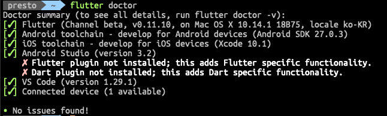

[시작하기](https://flutter.io/docs/get-started/)

# 설치

macOS 기준.

## Flutter SDK 설치

압축 파일을 적절한 디렉토리에 풀어준 후 해당 경로를 PATH 환경 변수에 저장해 주자.

이 작업은 일시적으로 PATH 변수를 설정하는 것이며, 나중에 PATH를 영구적으로 설정하게 된다.

이렇게 하여 flutter 명령어들을 사용할 수 있다.

## flutter doctor 명령어 실행하기

처음에는 이렇게 뜨지는 않고 몇 개는 느낌표가 떠 있을 것인데 또한 터미널에서 제시해주는 방법대로 해주면 체크 표시로 뱌뀌게 된다.

편집기로 VSCode를 사용한다면 Android Studio 밑에 뜨는 X 표시는 무시해도 될 것 같다.

Android든 iOS든 어떠한 기기도 컴퓨터와 연결되어 있지 않다면 Connected device에 느낌표가 뜨게 된다.

## PATH 환경 변수 갱신하기

하라는 대로 해준다.

## 플랫폼 설정

하라는 대로 해준다.

iOS의 경우 .xcworkspace에서 인증서 설정을 따로 해줄 필요가 있겠다.

Android의 경우 Android 스마트폰이 없어서 아마 에뮬레이터에서 돌릴텐데 안될 때 다시 봐보도록 하자.

# 편집기 설정

Visual Studio Code 기준.

역시 하라는 대로 해주면 이상 없이 잘 된다.

# 테스트 드라이브

VSCode의 명령 팔레트에서 `Flutter: New Project`를 선택하면 Flutter로 애플리케이션을 만들기 위한 기본 템플릿이 생성된다.

진입점 파일은 `lib/main.dart`에 위치한다.

F5를 눌러 디버깅 모드로 실행할 수 있다.

**HOT RELOAD!** 소스 코드 수정시 저장하는 것만으로도 변경 사항을 테스트 기기에서 바로 확인할 수 있다!

# 첫 번째 애플리케이션 작성하기

링크에 있는 코드를 참고하자.

---

그냥 계속 코드 작성해보자.