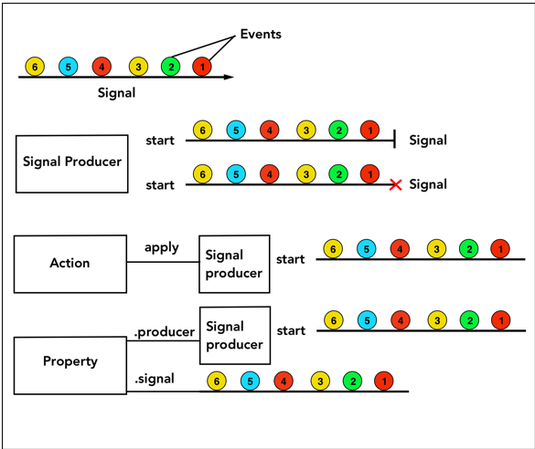
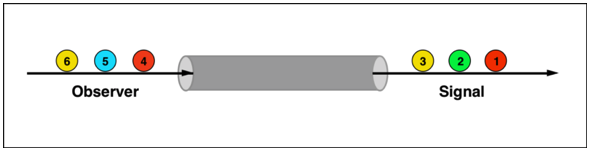

# FRP

> From a semantic viewpoint, FRP is all about describing a system in terms of time-varying functions instead of mutable state.
>
> By syntactic criterion, FRP is about specifying the dynamic behaviour of a value completely at the time of declaration.

FRP는,

- 변경 가능한 상태 대신, 시간에 따라 변화하는 함수의 관점에서 시스템을 묘사하는 것.
- 선언 시점에서 어떠한 값의 동적인 행위를 명시하는 것.

# Primitives

ReactiveSwift의 구성 요소를 알아본다.

## Source

FRP에서는 시간에 따른 일련의 변화로 시스템을 모델링하게 되며, Source 카테고리에 있는 것들은 이러한 변화를 만들고 전파할 책임이 있다.

### Event

무엇이 일어났는지에 대한 묘사. 스트림에 흘러가는 기본 전달 단위.

내부적으로 Event는 열거형으로 정의되었으며, Value, Failed의 경우 각각 이와 관련된 값, 에러를 연관 값으로 갖는다.

- Value : 유효한 정보를 담은 이벤트
- Failed : 에러를 담은 이벤트
- Completed : 스트림 완료의 의미를 담은 이벤트. 이 이벤트 이후로는 어떠한 이벤트도 방출되지 않는다.
- Interrupted : 이벤트 생산이 중단되었다는 것을 담은 이벤트.

### Signal

단방향 이벤트 스트림. 옵저버가 구독하게 하여 시그널의 각각의 이벤트에 접근할 수 있다. 이 행동은 시그널에 어떠한 사이드 이펙트도 일으키지 않는다. 

어떠한 시그널을 여러 옵저버가 구독하고 있을 때, 시그널에 이벤트가 전달되는 즉시 구독 중인 모든 옵저버에게 해당 이벤트가 전달된다.

내부적으로 Signal은 클래스로 구현되어 있어, SignalProducer가 값 의미론을 가지고 있는 반면, 이것은 참조 의미론을 가지고 있다는 것에 주목해야 한다.

### SignalProducer

Signal을 만드는 것. 나중에 일어나며 반복 가능한 작업을 캡슐화한다.

SignalProducer를 시작하여 새로운 Signal을 만들 수 있다.

SignalProducer는 Hot한 반면, Signal은 Cold하다고 말할 수 있다.

내부적으로 SignalProducer는 구조체로 구현되어 있어, Signal이 참조 의미론을 가지고 있는 반면, 이것은 값 의미론을 가지고 있다는 것에 주목해야 한다.

### Action

나중에 일어나며 반복 가능한 작업의 컨텍스트에서 사용된다. SignalProducer의 작업을 캡슐화한다.

입력과 최신 상태를 사전에 정의된 작업에 넣어, 출력을 만들어 옵저버에게 전달한다.

### Property

값을 저장하고 이후의 변화를 옵저버에게 알릴 수 있는 관찰 가능한 박스.

이 Primitive로 SignalProducer나 Signal을 만들 수 있다.



<그림1. Source들의 다이어그램.>

## Operators

Source가 Consumer에 의해 소비되는 방법을 명시한다. Side-Effect, Transform, Combine, Flatten, Error Handling 등의 역할을 수행한다.

## Consumer

Consumer는 Source가 방출한 이벤트를 감지하고 그에 따라 행동한다.

### Observer

방출된 이벤트에 반응하여 수행될 작업을 캡슐화한다.

내부적으로는 Event를 인자로 받는 간단한 클로저일 뿐이다.

### MutableProperty

Property와 비슷하나, 직접적으로 변경될 수 있다.

BindingTargetProvider 프로토콜을 채택하였기 때문에, Source가 시간에 따라 방출하는 값을 바인딩할 수 있다.

## Scope

Source와 Consumer 사이 상호 작용의 수명을 결정한다.

### Disposable

메모리 관리 및 취소와 관련된 메커니즘. 

Signal을 옵저빙하거나 SignalProducer를 시작하면 Disposable이 반환되며, 이것을 dispose하여 이후 이벤트를 관찰하지 않게 할 수 있다. 이 행위는 Signal에 어떠한 영향도 주지 않는다.

### Lifetime

오브젝트의 수명을 나타낸다. 관찰이 관찰자보다 오래 살아남아있을 때 활용할 수 있다.

예를 들어, 어떠한 UI가 화면 상에 있을 때만 노티피케이션을 관찰하고 싶다면 이를 활용할 수 있다.

# Signal and Observer

## Signal

FRP의 "시간에 따라 변화하는 상태"의 개념이 Signal에 담겼다.

Signal의 기본 단위인 Event는 위에 기술한 것 (Value / Completed / Failed / Interrupted) 중 하나가 된다.

Signal은 Failed / Completed / Interrupted 이벤트가 발생할 때까지 Value 이벤트를 스트림에 전달한다. Failed / Completed / Interrupted 이벤트가 발생하면 값을 전달하는 것을 중단한다.

## Observer

Signal이 방출하는 이벤트를 관찰하기 위해 사용한다. (Event) → Void 타입의 클로저이며, 각 케이스에 따른 적절한 처리를 수행하게 할 수 있다.



<그림2. Signal의 pipe() 메소드로 생성된 Observer와 Signal의 관계. Signal은 입력 옵저버에 종료 이벤트가 전송되거나, 옵저버가 더이상 존재하지 않고 강한 참조도 없을 때 메모리에서 해제된다.>

> The input represents all the subscribers of the signal. When we want to send an event to signal, we invoke `send(value:)` of the input. This will trigger `send` of all the subscribed observer and the closure associated with the observers will be executed.

pipe() 메소드에 의해 생성된 Observer는 pipe() 메소드에 의해 생성된 Signal을 관찰하고 있다는 의미보다는, 그 Signal을 관찰하는 모든 Observer를 대표한다고 생각하면 될 것 같다.

파이프 획득 → 입력 옵저버에 값 전달 → 출력 옵저버가 이를 감지함

# SignalProducer

Signal을 생산하는 것. Signal을 만들 때 시작되는, 연기되고 반복 가능한 작업을 캡슐화한다.

SignalProducer를 만들 때, interrupted 되었을 때 리소스를 해제하고 진행 중인 작업을 중단하도록 해야 한다.

## Signal vs. SignalProducer

- Signal은 rx의 개념에서 말하자면 Hot Observable. 실시간 스트리밍 서비스라고 생각하면 된다. 해당 스트림을 구독하는 타이밍에 이전에 배출된 아이템은 받을 수 없다.
- SignalProducer는 rx의 개념에서 말하자면 Cold Observable. VOD 서비스라고 생각하면 된다. 해당 스트림을 구독할 타이밍, 중지할 타이밍 등을 제어할 수 있다.
- SignalProducer는 Signal을 생성하는 공장 같은 개념. 그렇기 때문에 매번 다른 Signal이 생성될 수 있다. 
  - 내부적으로도 Signal은 Reference Semantics, SignalProducer는 Value Semantics를 갖는다.

# Property

## Property

값이 변화할 때마다 값을 방출하는 관찰 가능한 컨테이너.

이는 PropertyProtocol 프로토콜을 준수하며, 현재 값 (value) / producer / signal 을 프로퍼티로 갖는다.

MutableProperty와는 다르게 직접적으로 변화시킬 수 없다 : 읽기 전용

- Property에 의해 생성된 SignalProducer는 현재 값과 그 다음 변경 사항들을 전송한다. Property가 소멸되거나 더이상 변화가 없을 때 완료된다.
- Property에 의해 생성된 Signal은 다음 변경 사항들을 전송하며, 현재 값은 전송하지 않는다. Property가 소멸되거나 더이상 변화가 없을 때 완료된다.

### Constant Property

`Property(value:)`로 생성하며, 이렇게 생성된 프로퍼티의 producer나 signal은 이니셜라이징될 때 즉시 완료된다.

### Existential Property

`Property(capturing:)`으로 생성되며, 임의의 `PropertyProtocol` 타입을 인자로 받아, 그 행위를 전달한다.

> Existential property would be deprecated when generalized existential eventually lands in Swift.

### Composed Property

여러 개의 property, signal, producer를 조합하여 만들어지는 property. `Property(_:)`, `Property(initial:then:)`으로 생성할 수 있다.

Lifetime은 그 자체가 가지고 있지 않고, 조합된 소스들에 의해 결정된다.

## MutableProperty

Property처럼, 값이 변화할 때마다 값을 방출하는 관찰 가능한 컨테이너이나, 직접적으로 변화시킬 수 있다.

이 또한 PropertyProtocol 프로토콜을 준수한다.

초기값과 함께 초기화되며, value 프로퍼티에 직접 접근하여 현재 값을 변경할 수 있다.

바인딩 가능하다. (<~ 연산자의 왼쪽에 위치할 수 있다.)

# Action

이해하기 쉽지 않으므로 여러 번 반복하여 참고하자.

> An action is defined as a unit of repeatable work which gets executed with a varying input.

Action은 다양한 입력과 함께 실행되는, 반복 가능한 작업의 단위로 정의된다.

나중에 시작될 수 있는 반복 가능한 작업을 나타낸다. 

SignalProducer와 비교하여, 다음의 특징을 가지고 있다.

- Serial Execution
- 다양한 입력을 제공함
- 조건적 실행을 가능하게 함
- 이미 진행 중인 작업인지 확인함

어떠한 작업들을 상호 배타적으로, 직렬적으로 실행하기 위해 활용할 수 있다.

Action의 코어는 `execute` 클로저이며, 이는 SignalProducer의 형태에서 반복 가능한 작업 단위를 캡슐화한다. Action이 `apply()`을 통하여 호출될 때, `execute` 클로저가 실행되어 SignalProducer를 만든다. 이후 결과 SignalProducer에 `start` 호출을 할 필요가 있다. 일단 호출되면, 0개 이상의 값이 전달되고 어떠한 지점에서 종료되며, 에러와 함께 종료될 수도 있다. 실행이 진행 중일 때 Action은 비활성화된다. 즉, 현재 실행이 완료될 때까지 Action은 시작될 수 없다.

Action이 갖는 프로퍼티 중 몇 개를 소개하자면,

- values : Action의 모든 호출로부터 생성되는 모든 값들의 signal
- error : Action의 모든 호출로부터 생성되는 모든 에러들의 signal
- isExecuting : Property<Bool> 타입. Action이 현재 실행 중인지.
- isEnabled : Property<Bool> 타입. Action이 현재 활성화되어 있는지. 

세 개의 제네릭 매개변수를 받으며, 순서대로 입력 / 출력 / 에러의 타입을 정의한다.

```
public final class Action<Input, Output, Error: Swift.Error>
```

- Input : `apply()` 메소드에 의하여 공급되는 외부로부터의 입력
- Output : Action의 signal이 배출하는 값의 타입
- Error : signal이 전달하는 에러의 타입

`Action(state:enabledIf:execute:)`를 사용하여 Property 타입의 상태, 조건적 실행을 위한 조건, 실행 작업을 전달할 수 있다.

# 참고한 레퍼런스

<https://medium.com/fueled-engineering/https-medium-com-hsusmita-conquering-reactiveswift-action-tutorial-6-58dae11300b5>

<http://reactivecocoa.io/reactiveswift/docs/latest/index.html>